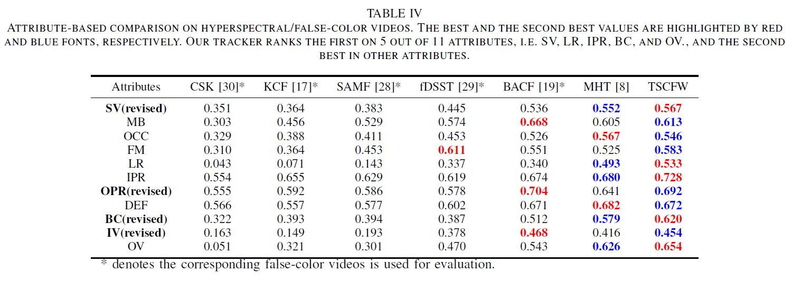

# Hyperspectral-Object-Tracking-TSCFW
There are the source codes for this paper called " Spatial-spectral Weighted and Regularized Tensor Sparse Correlation Filter for Object Tracking in Hyperspectral Videos"

**This paper is availavle on IEEE Xplore. The source codes of the TSCFW tracker is available.**


Fig.1. Schematic of the proposed TSCFW framework


Fig.2. Visualization of results on 4 video sequences (i.e., drive, book, forest, paper). Bounding box in different colors are results from different trackers.


# Visualization Tracking Results

<table><tr>
  <td></td>
  <td></td>
</tr></table>

**Note that**: these two datasets are board and paper scenarios, respectively, where the black bounding box is TSCFW tracker, the blue is ground truth, and the red is MHT tracker. 
# Prerequisites
**MATLAB R2018a**

Please unzip the tensor_toolbox_2.5.zip toolkit before running the TSCFW code.


# Source
**Paper Download:**<br />
- [IEEE Xplore](https://ieeexplore.ieee.org/document/9924160)


# Citation

If these codes are helpful for you, please cite this paper:

**BibTex Format:**<br />

```
@ARTICLE{9924160,  
author={Hou, Zengfu and Li, Wei and Zhou, Jun and Tao, Ran},  
journal={IEEE Transactions on Geoscience and Remote Sensing},   
title={Spatial–Spectral Weighted and Regularized Tensor Sparse Correlation Filter for Object Tracking in Hyperspectral Videos},   
year={2022},  
volume={60},  
number={},  
pages={1-12},  
doi={10.1109/TGRS.2022.3215431}}
```


**Plain Text Format:**<br />

```
Z. Hou, W. Li, J. Zhou and R. Tao, "Spatial–Spectral Weighted and Regularized Tensor Sparse Correlation Filter for Object Tracking in Hyperspectral Videos," in IEEE Transactions on Geoscience and Remote Sensing, vol. 60, pp. 1-12, 2022, Art no. 5541012, doi: 10.1109/TGRS.2022.3215431.
```


# Error Revised
Our attribute evaluation code is developed based on the MATLAB program, and the space symbol is included in the description.txt file in some scenarios, which resulted in the program being unable to correctly match the attribute keywords in our defined dictionary, resulting in some attribute scenarios evaluation errors. **However, the conclusion of the paper was not affected**. The corrected results are as follows:


**Revised TABLE IV for Attribute Evaluation Results.**


# Website
- [Github Website](https://zephyrhours.github.io/)
- [Chinese CSDN](https://blog.csdn.net/NBDwo)
